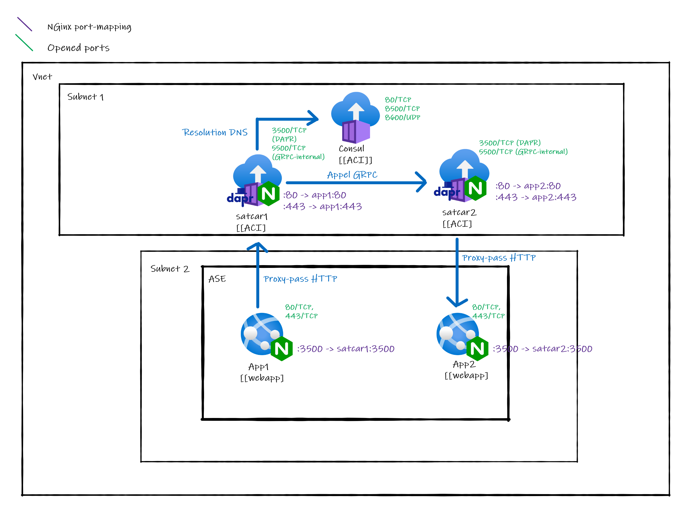
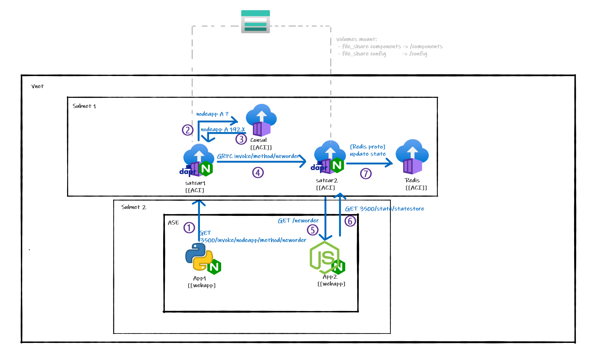
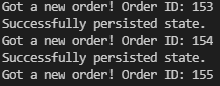
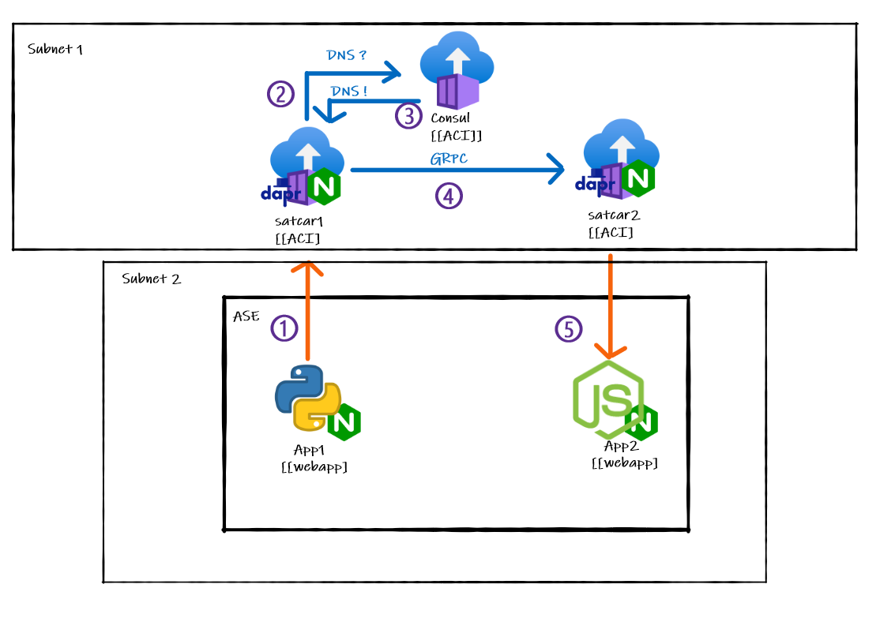
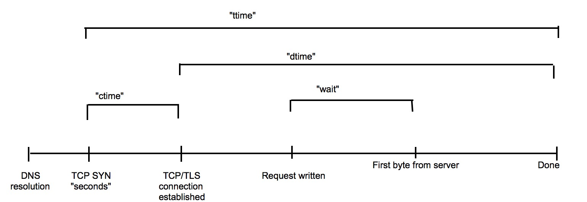
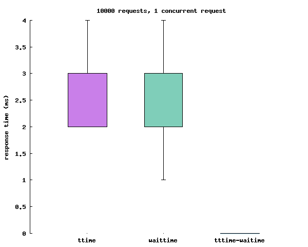

# Dapr on App Service Environment

The purpose of this repository is to include [Dapr](https://dapr.io/), in an [Azure App Service Environment (ASE)](https://docs.microsoft.com/en-us/azure/app-service/environment/overview). This is an exploratory solution, intended to find ways to add the covenience of Dapr in the already well-established ASE ecosystem.

## Considered solutions

+ Using App Service built-in support for docker-compose (see subdirectory : @TDB)
    + **Advantages** : Very simple
    + **Result** : Numerous networking-related options aren't supported yet, reproducing a "sidecar-like" interaction is **not possible at the moment**

+ Making the main app process launch the Dapr runtime (daprd) (see subdirectory : @TDB) 
    + **Advantages** : Compatible with non-containerized workloads 
    + **Result** : Although the "sidecar" is working, ASE does not allow for HTTP/2.0 (what GRPC is based on). However, in Dapr, Sidecar to sidecar communication must be over GRPC. Thus, **this won't work at the moment**.

+  Externalizing sidecars using [Azure Container Instances (ACI)](https://docs.microsoft.com/en-us/azure/container-instances/)
    + **Advantages** : A lot easier to see sidecar state
    + **Result** : This is the **chosen approach**. Externalizing sidecar allows for sidecar to sidecar communication to work without any problems. However, a sidecar should be using the same localhost interface as the process its helping. To run a sidecar is a separate service altogether, some proxies are used. This may have some performances impact (see [viability and performances considerations](#viability-and-performance-consideration)). As these helpers processes aren't at the main process side anymore, but more of a "satellite processes", they'll be called from now on satcars.


## Chosen solution

The chosen solution is to externalize sidecars. As said earlier, this specific approach is meant to circumvent the HTTP2.0/GRPC incompatibility of ASEs. To allow for "localhost forwarding", a simple nginx reverse proxy is used both on the sidecar side and ont he main app side. 

A normal Dapr [service invocation](https://docs.dapr.io/developing-applications/building-blocks/service-invocation/service-invocation-overview/) is made in this way:

Service A is calling service B:
 + _Service A_ is calling its Dapr sidecar (using `HTTP/GRPC` on __localhost:3500__)
 + _Service A_'s sidecar is resolving the name of _Service B_ to find its IP address (ore more precisely, **the IP address of its sidecar**) (using `mDNS by default`)
 + _Service A_'s sidecar is forwarding the request to _Service B_'s sidecar (using `GRPC only`)
 + _Service B_'s sidecar is forwarding the request to _Service B_ (using `HTTP/GRPC` on __localhost:[EXPOSED_APP_PORT]__)
 + (The result goes all the way back to _Service A_)

To reproduce the same workflow with externals sidecar, we have to tweak the architecture a bit :

_App1_ is calling _App2_:
 + _App 1_ is calling its Dapr sidecar using `HTTP` on __localhost:3500__. The HTTP call is then proxied to _satcar1_ by the Nginx process listening on __localhost:3500__.
 + _satcar1_ is resolving the name of _App2_ to find the IP address of _satcar2_ (which would normally be the same as the IP address of _App2_ but not in this case). mDNS can't be used on an ASE, so a **separate [Consul](https://www.consul.io/) instance** is used a name resolver using [Dapr's name resolver component](https://docs.dapr.io/reference/components-reference/supported-name-resolution/setup-nr-consul/). 
 + _satcar1_ is forwarding the request to _satcar2_ (using `GRPC only`)
 + _satcar2_ is forwarding the request to _App2_ (using `HTTP/GRPC` on __localhost:[EXPOSED_APP_PORT]__)
 + (The result goes all the way back to _App1_)


### Demo app
To test this new workflow, a Pub/Sub demo app is used. This demo app is actually the [hello-docker-compose sample](https://github.com/dapr/samples/tree/master/hello-docker-compose) of the Dapr repository. 



The Python app wants to publish a state. It does so by calling the `/neworder` method on the NodeJS app. The node app is then persisting the stae in the Redis statestore, using Dapr as a layer of abstraction. 
This demo app is demonstrating both service invocation and the use of [bindings](https://docs.dapr.io/developing-applications/building-blocks/bindings/bindings-overview/). 

To configure both Dapr config and binding, a [File Share](https://docs.microsoft.com/en-us/azure/storage/files/storage-how-to-create-file-share?tabs=azure-portal) hosted on an [Azure Storage Account](https://docs.microsoft.com/en-us/azure/storage/common/storage-account-overview) is leveraged. This ways, both _satcar1_ and _satcar2_ can share the exact same configuration without any duplication. This configuration could also be edited on the fly.  

Three custom apps are used in this demo :
- Nodeapp (_App2_) [see Readme](/src/using-satcars/node)
- Pythonapp (_App1_) [see Readme](/src/using-satcars/python)
- Satcar (_satcar1_ and _satcat2_) [see Readme](/src/using-satcars/satcar)


#### Running it locally
To run the demo app locally, you must have Docker and make installed. Then run :
```sh
# The OPTIMIZE flag can be set to 1. 
# This will reduce the container final size by compressing the binaries (when applicable). 
# This will however erase debug symbols, do not use it in development
# -j4 is optional, this will use multiple threads (4) to to the compiling/building.
# Stdout with -jX will be messy 
make OPTIMIZE=0 -j4 run 
```
This will pull/build the necessary containers and start the apps.

By default, `make run` will end by attaching the current terminal to _App2_. 
The following prompt should be visible



This means that the state created by _App1_ has successfully been persisted to the Redis instance using _App2_.

You can then stop the containers with 

```sh
make stop
```

You can also push the nodeapp, pythonapp, satcar images to Dockerhub with the following command

```sh
make push DOCKERHUB_USERNAME=<YOUR_DOCKERHUB_USENAME>
```

#### Deploying it on azure 

To deploy the app on Azure (using Terraform), use the following commands :
```sh
cd deploy
terraform apply 
```

The deployment will last 2 and a half hours or so (creating an ASE takes a long time). 


## Viability and performance consideration

Externalizing sidecars might have a performance impact. Every HTTP call between a container and its sidecar is now not a simple localhost call anymore, but has to get in and out of the ASE. This part will try to quantify this impact.

### Testing the additional links

Simplifying the [service invocation graph](#chosen-solution) above, we can easily find the additional links that may have a performances penalty.


In a more traditional approach, the `orange links` should be localhost calls, these are the ones that we must measure. 

On the other hand, the following calls are considered out of scope:
+ **Cross-sidecar GRPC** : Not an additional call, plus there is no workflow modification whatsoever nor some redirection trick. Comparing this to its counterpart on a "classic" Kubernetes deployment would only compare Azure subnet to Kubernetes network.   
+ **DNS resolution** : Same as above. Including this would measure networks or pit mDNS/Consul/CoreDNS against each other.   

### Protocol

#### Endpoint

Each DAPR process expose an health endpoint at `/v1.0/healthz`. This endpoint provide a consistent way to test the orange links, whilst preventing any caching mechanism, current or future, to affect the results. 
As usual, the **two way Round Trip Time (RTT)** will be measured. 

#### Software

The software used for testing the latency of an HTTP call is [Apache Bench](https://httpd.apache.org/docs/2.4/programs/ab.html). An Apache Bench is usually shown this way: 

(Values are purely random)
| starttime | seconds | ctime | dtime | ttime | wait |
|-----------|---------|-------|-------|-------|------|
| X         | X       | 0     | 2     | 2     | 1    |
| X         | X       | 1     | 2     | 2     | 1    |
|           |         |       |       |       |      |

where **starttime** and **seconds** both are the time the call started. **starttime** being in an user-readable format, **seconds** being a timestamp.

The others columns can be understood that way :


+ **ctime** is the time (in ms) to establish a proper TCP connection from the first _SYN_ to the last _SYN ACK_.
+ **dtime** is the time (in ms) to process the actual request
+ **wait** is the time (in ms) spent waiting for the server to process the request before answering.
+ **ttime** is the sum of the above

From this values, we can compute the raw network additional latency with **ttime - wait**

### Test setup

A very simple way to test is to SSH into either _App1_ or _App2_ and install the required softwares.
```sh
# Installing apache-bench and gnuplot to make a graph
apk add apache2-utils gnuplot curl
# Send 10 000 requests with a concurency of 1 and store the results
# in res.csv
ab -g res.csv -n 10000 -c 1 localhost:3500/v1.0/healtz
# Boxplot the results up
cat <<EOT > plot.p
set terminal png size 600
set style fill solid 0.5 border -1
set style boxplot nooutliers pointtype 7
set style data boxplot
set boxwidth  0.5
set pointsize 0.5

unset key
set border 2
set xtics border in scale 0,0 nomirror norotate  autojustify
set xtics  norangelimit 
set ytics border in scale 1,0.5 nomirror norotate  autojustify
set xtics ("ttime" 1, "waittime" 2, "tttime-waitime" 3) scale 0.0
set xtics nomirror
set ytics nomirror

set output "results.png"
set title"10000 requests, 1 concurrent request "
set ylabel"response time (ms)"

plot "res.csv" using (1):9, '' using (2):10, '' using (3):($9-$10)
EOT
gnuplot plot.p
# Convert image to base64, useful if you are on a web-based ssh session and copy files back and forth
cat results.png | base64

# Plug the base 64 into this site to get the image back :
# https://base64.guru/converter/decode/image

```

### Results



@TDB Conclusion