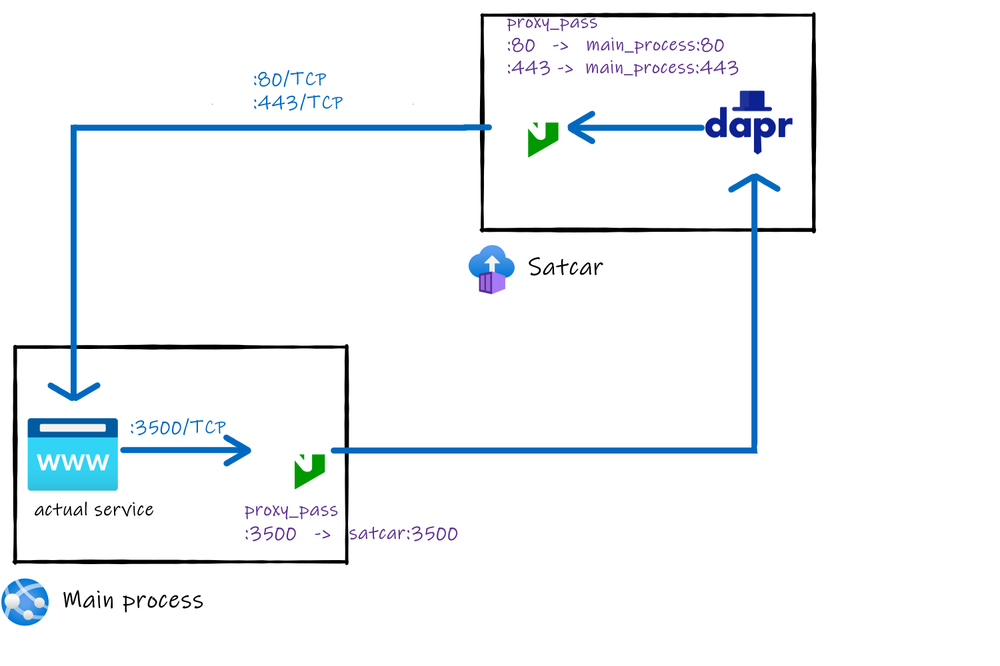

# "Satcar" image

Daprd is normally used as a "sidecar", a process attached to another process (henceforth called **main process**). As AppService is not compatible with GRPC as of yet, we have to detach the sidecar and run it in another service (Azure Container Instance). 

Dapr is normally using the localhost interface to communicate with the main process. As this isn't possible when using two services, a Nginx reverse proxy is used in its stead. This proxy is mapping this container localhost interface to the linked main process localhost interface, hosted in an appservice.

This pseudo-sidecar is not really to the main process side anymore, this is more of a "satellite process", hence **satcar**.




## Configuration

This container is **requiring** the following env variables :
- APP_ID : Linked application ID. This is the named that would be used in Dapr's [service invocation](https://docs.dapr.io/developing-applications/building-blocks/service-invocation/service-invocation-overview/).
- APP_HOST: Main process URL/IP (without http://). This must be accessible from the satcar.
- APP_PORT: Main process exposed port. This is most likely 80 or 443 if the main process is hosted in an AppService.  
- PLACEMENT_HOST: [Dapr placement service](https://docs.dapr.io/concepts/dapr-services/placement/) URL/IP. This is mandatory to use actors.
- PLACEMENT_HOST: Dapr placement service port.

The process will abort if any of these aren't defined at runtime.

## Deployment

The following ports must be opened on the container

- 3500/TCP : Main process -> Dapr communication
- 5555/TCP : Dapr <-> Dapr communication 

## Using config and bindings

Both DAPR's config and bindings can be provided as volumes.

- **Bindings** can be provided in the volume mount /components
- **Config** can be provided in the volume mount /config

Example of running a satcar:

```sh
    docker run -d --name satcarnode --network=${DEMO_NETWORK} -e PLACEMENT_HOST=${DEMO_PLACEMENT_NAME} -e PLACEMENT_PORT=50006 -e APP_ID=nodeapp -e APP_PORT=80 -e APP_HOST=nodeapp -v ${LOCAL_COMPONENTS_PATH}:/components -v ${LOCAL_CONFIG_PATH}:/config satcar

```


